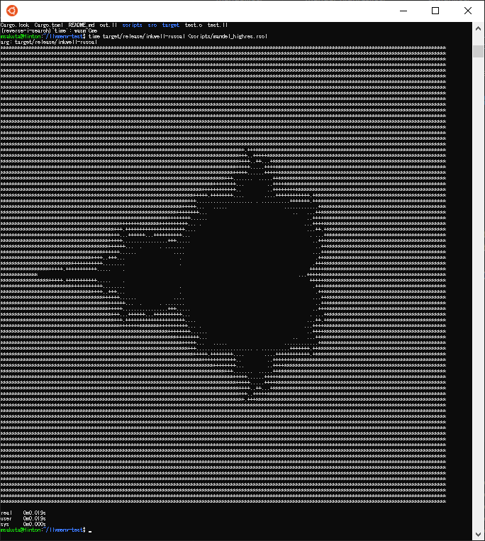

# inkwell-ruscal

A test repository to support native compile for [Ruscal](https://github.com/msakuta/ruscal) language

It does not reference Ruscal language itself (yet).
It works on a subset of the full language.


## How to run

1. Install Rust.
2. Install LLVM 10. If you are on Ubuntu 20.04, run `sudo apt update && sudo apt install llvm-10-dev`
3. Run `cargo r <scripts/fn_call.rscl` or other example scripts ending `.rscl`

Note that specific LLVM version shouldn't matter.
If you have a different version, just change the inkwell line in [Cargo.toml](Cargo.toml).


## Speed comparison

As a reference, we compare the performance of each execution model with the same output: [mandel.rscl](scripts/mandel.rscl).
Note that AST interpreter and bytecode are implemented in [Ruscal](https://github.com/msakuta/ruscal).

|         | AST interpreter  | Bytecode    | LLVM IR | C      | Rustc |
| ------- | --------------- | ------------ | ------- | ------ | ----- |
| Time [s] |  0.320          |      0.105   |  0.016  | 0.004 | 0.006 |



You can build reference implementation of Mandelbrot set renderer in C with

```
gcc -O3 mandel.c -o mandel
```

and for Rust

```
rustc -O mandel.rs -o mandel-rs
```